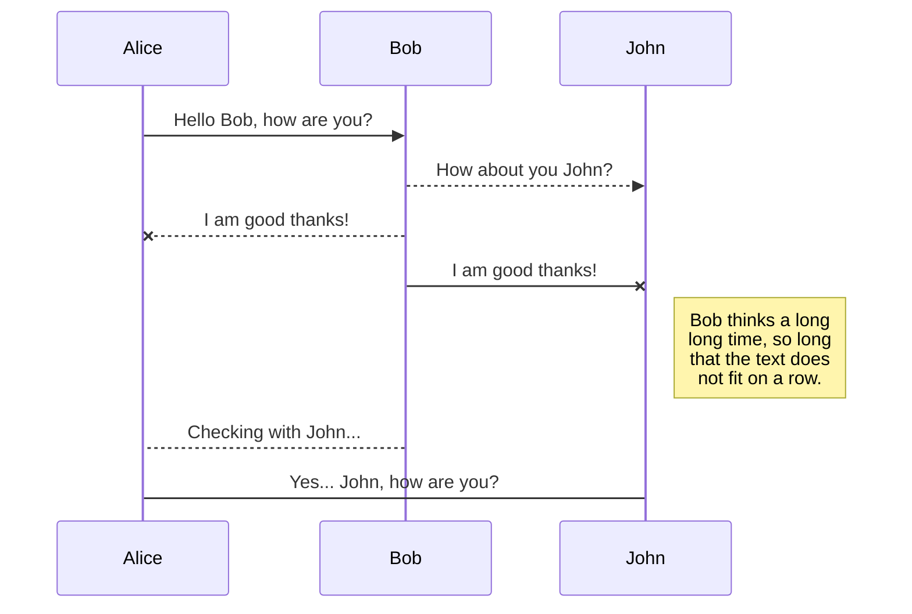
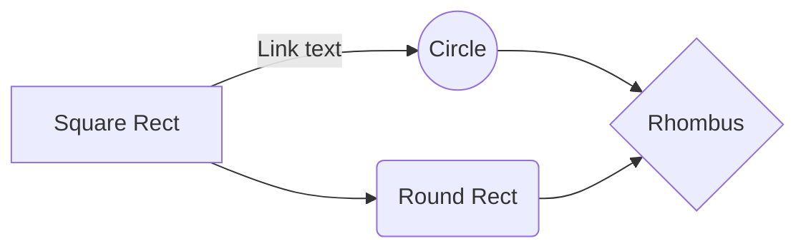

# Google sheets usecase solution:

# Approach 1

**Using app script extension: Create an HTML form and a sample google sheet. Then using the app script extension, create a get request that stores data from the html form on the google sheet.

Pros : fast and easy way to connect forms to google sheets

Cons: it is not secure and is highly dependent on google sheets API. it also not very scalable to a large user base and it is very difficult to add on new services to form like an sms confirmation on form submission etc since there is no use of middlewares to connect the client side form to the database(in this case google sheets)

# **Approach 2**

**Creating APIs in Nodejs to communicate with google sheets API:** created a service account on GCP. Created a service API key that gave a dummy email address with which the google sheets can be shared. That dummy email has read and write permissions to edit the google sheet. With this functionality, our nodeJs app gets full auth to read and write data to the google sheets using that dummy email address as a proxy. Added all the API key credentials to the nodejs project.

In the nodejs project created a client object and got the metadata about the spreadsheet and stored it in a variable “metadata” by making a get request on the google spreadsheet api. Passed the spreadsheet from URL as a parameter to the get request to the metadata

I was able to get the properties of the spreadsheet like title, column name, row count, column count, etc

Then I created a post request function that takes multiple responses from the form in an array and stores multiple responses simultaneously to the google sheet

For designing the form, I used ejs as a view engine to fill up the rows of the google sheet.

**Addition of SMS service to the form:** Added Twilio SMS service to the same post request that sends a confirmation message to the user upon filing up the form with SMS body containing the user details as specified in task 4 to the user’s phone number

**Pros:** Secure way to send data from Form to google sheets as we use an API_KEY provided by google and the person having access to API_KEY can read/write data to google sheets from the NodeJs app. It is scalable to a large user base as we call the google sheets API to append the data to sheets in an efficient way. More add-on services like SMS confirmation can be added on form submission since we are using middlewares (expressJs) to communicate between the Nodejs app and the Google sheets

**Cons:** Google sheets API is called every time a user submits the form which causes a definite time delay and makes the form submission process slower. In case the google server is down it may lead to a loss of user responses as data would not get stored on the google sheets.

**Solution:**
We can use the MySQL database to store the form responses in case google sheets API stops responding or the server goes down. In that case, we can store the response in a MySQL table and update the google sheets by exporting the data from MySQL when the server is up and running.

## Approach 3 (final implemented approach)

Created an instance of MySQL DB on AWS rbs. Then configured the MySQL instance to connect it to the HTML form using nodejs. Used the cloud database to store the form responses. Then I wrote a scripting function in google app scripts to connect a google sheet to the AWS database. Then I created 2 trigger functions in the google app scripts console. Triggers:

1.  On open trigger: this trigger is fired whenever the person opens the google sheet to view the form responses. The fired trigger calls the createConnection method that copies stored data from the AWS database into the google sheet.
    
2.  Timed trigger: In case the google sheet is not opened then the timed trigger will be fired after the time for which the form was active elapses(similar to google forms) and the timed trigger calls the createConnection method that copies form response and questions from the AWS database and stores it into the google sheet in the desired manner.
    

The AWS database acts as a Backup data recovery platform in case the google sheets API stops responding or responses are not recorded on the google sheets due to a server outage, We have a record of all the form responses in the MySQL cloud DB.

Also if any modifications are done to the data in the MySQL db, they are automatically reflected in the google sheet due to the active triggers in place.

SMS use case: This approach can be used to add more services like an SMS confirmation to the user on form submission in a Plug-and-play fashion. I used the Twilio SMS gateway service as used in approach 2 to send an SMS to the user upon form submission with the SMS body comprising of the details of the user (TASK 4).

Solutions to TASK 1 and TASK 2(implemented) can be implemented using this approach by writing SQL queries since we have all the responses in the MySQL database

Used google app script to create a connection between google sheets and cloud SQL server. Then send stored data from cloud SQL db to google sheets by setting up triggers. The triggers are fired when the client opens the google sheet thereby fetching all data from the cloud DB to the google sheet. I had also implemented timed triggers to automatically populate the spreadsheet by fetching data from cloud SQL that acts as a data backup in this case.

**Pros and improvemts over approach 2**: 

 1. Secure way to send data from Form Form to google sheets as CLod SQL acts as data backup for recovery incase data gets deleted from google sheets
 2. Improved user experience as form response is immediately submitted to CLoud sql db eliminating the delay time caused during google sheets api call discussed in approach 2
 3. More services like SMS integration can be added in a plug-n-play fashion without causing overhaul on the backend
 4. Triggers have been implemented that automatically update data on google sheets as and when needed
 5. Form app can store upto millions of responses without crashing as records are being stored in AWS cloud instance with autoscaling feature in place
 
## SmartyPants

SmartyPants converts ASCII punctuation characters into "smart" typographic punctuation HTML entities. For example:

|                |ASCII                          |HTML                         |
|----------------|-------------------------------|-----------------------------|
|Single backticks|`'Isn't this fun?'`            |'Isn't this fun?'            |
|Quotes          |`"Isn't this fun?"`            |"Isn't this fun?"            |
|Dashes          |`-- is en-dash, --- is em-dash`|-- is en-dash, --- is em-dash|

## KaTeX

You can render LaTeX mathematical expressions using [KaTeX](https://khan.github.io/KaTeX/):

The *Gamma function* satisfying $\Gamma(n) = (n-1)!\quad\forall n\in\mathbb N$ is via the Euler integral

$$
\Gamma(z) = \int_0^\infty t^{z-1}e^{-t}dt\,.
$$

> You can find more information about **LaTeX** mathematical expressions [here](http://meta.math.stackexchange.com/questions/5020/mathjax-basic-tutorial-and-quick-reference).

## UML diagrams

You can render UML diagrams using [Mermaid](https://mermaidjs.github.io/). For example, this will produce a sequence diagram:

And this will produce a flow chart:

